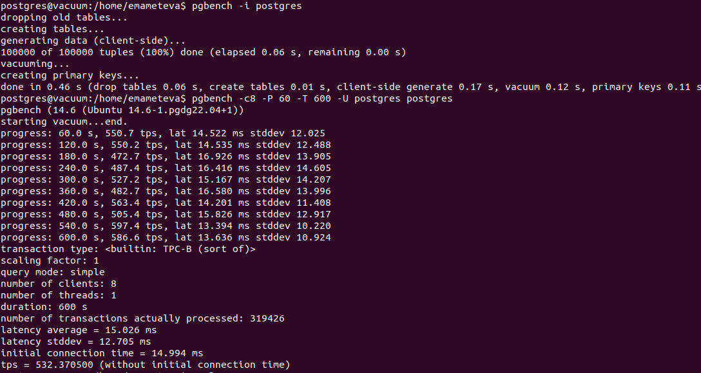
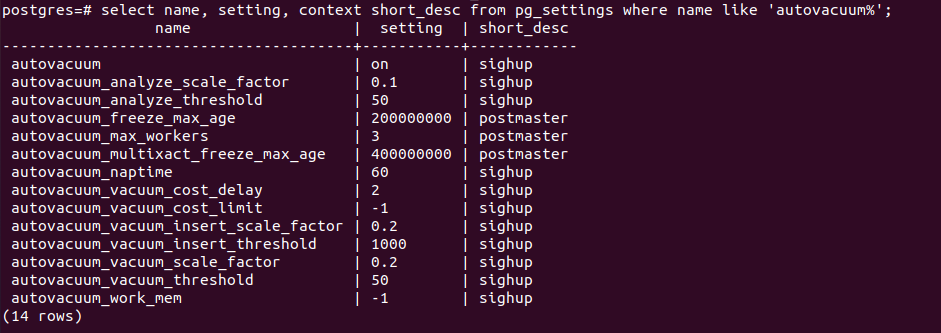
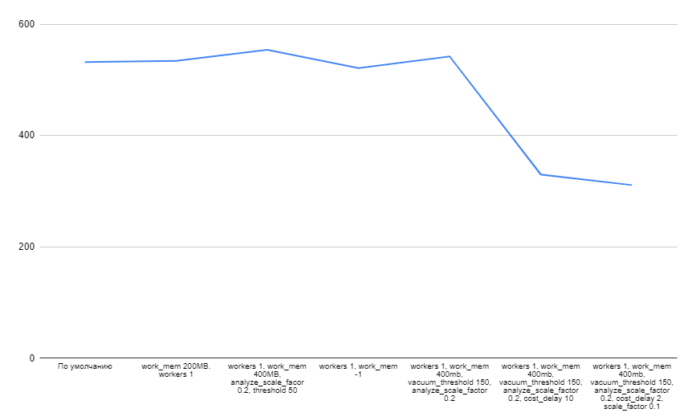
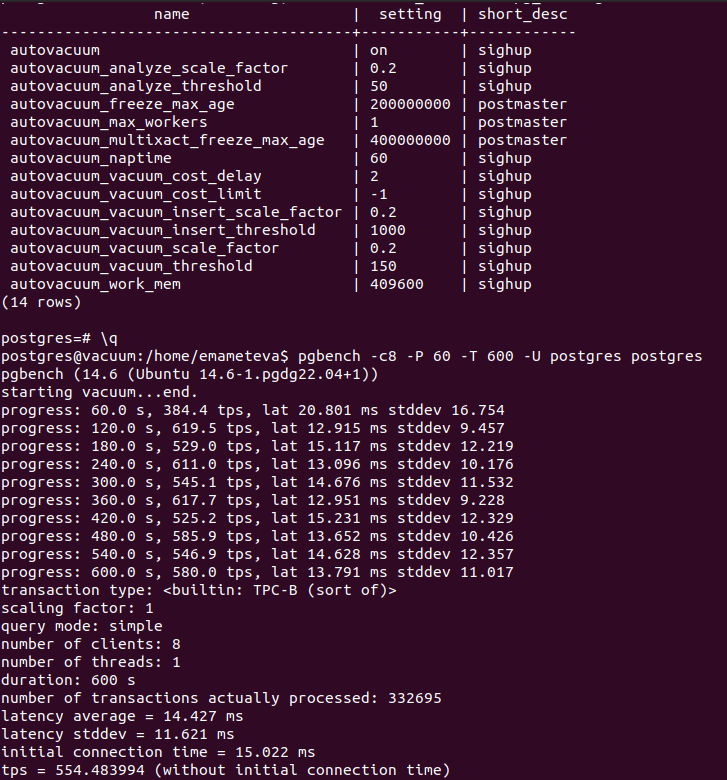

# OTUS-homework_5
* Создаем инстанс в ЯО с параметрами:

* Устанавливаем 14 postgres и применяем параметры из файла:
max_connections = 40
shared_buffers = 1GB
effective_cache_size = 3GB
maintenance_work_mem = 512MB
checkpoint_completion_target = 0.9
wal_buffers = 16MB
default_statistics_target = 500
random_page_cost = 4
effective_io_concurrency = 2
work_mem = 6553kB
min_wal_size = 4GB
max_wal_size = 16GB

* Выполняем pgbench -i postgres а затем pgbench -c8 -P 60 -T 600 -U postgres postgres

* Дефолтные настройки:

Пробуем настройки autovacuum

В основном tps варьировался немного - от 520 до 560. Были настройки которые проседали до 300tps (при cost_delay больше 2).

Но самым "ровным" вариантом был - autovacuum_max_workers 1, autovacuum_work_mem 400MB, autovacuum_analyze_scale_facor 0.2, autovacuum_vacuum_threshold 50.

